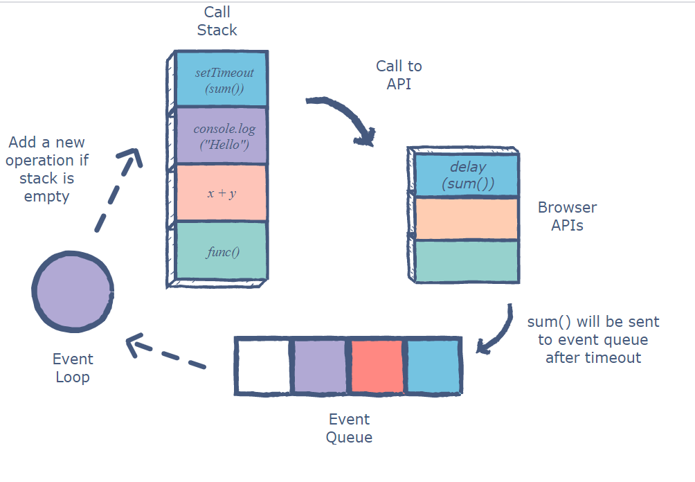

자바스크립트는 `단일 스레드`를 기반으로 동작하는 언어다.  
이는 하나의 **메인 스레드**에서 **한 번에 하나의 작업**만을 처리할 수 있다는 것이다. 기존에 진행 중인 작업이 있으면 중간에 다른 작업이 끼어들 수 없고, 기존 작업이 완료된 후에 그 다음 작업을 차례대로 수행한다.

하지만 실제 웹 브라우저에서는 많은 작업이 동시에 처리되는 것을 볼 수 있다. NodeJS 웹 서버에서는 동시에 여러 개의 HTTP 요청을 처리하기도 한다. 단일 스레드 기반의 자바스크립트가 이러한 동시성(concurrency)을 지원할 수 있는 것은 `이벤트 루프`가 있기 때문이다.

> 자바스크립트는 코드 실행, 이벤트 수집과 처리, 큐(queue)에 놓인 하위 작업들을 담당하는 **이벤트 루프**에 기반한 동시성 모델을 가지고 있다.

즉, 자바스크립트는 이벤트 루프를 이용해서 **비동기 방식으로 동시성을 지원**한다.

---

이벤트 루프는 브라우저에 내장되어 있는 기능이다. 구글 V8 엔진을 비롯한 대부분의 자바스크립트 엔진은 크게 2개의 영역, `콜 스택(call stack)`과 `힙(heap)`으로 구성되어 있다.

- `콜 스택(call stack)`  
  소스 코드 평가 과정에서 생성된 **실행 컨텍스트가 추가 및 제거**되는 스택 자료구조다.  
  보통 함수가 실행되는 순서를 기억하고 있다가 함수가 호출되면 함수 실행 컨텍스트가 스택에 추가되어 **순차적으로 실행**된다. 해당 함수 실행이 종료되면 스택에서 제거된다.
- `힙(heap)`  
  **객체가 할당되는 메모리 공간**으로 콜 스택의 요소인 **실행 컨텍스트가 힙에 저장된 객체를 참조**한다. 메모리에 값을 저장하려면 먼저 값을 저장할 메모리 공간의 크기를 결정해야 한다. 객체는 원시 타입의 값과 달리 그 크기를 런타임에 결정(동적 할당)해야하므로 객체가 저장되는 메모리 공간인 힙은 **구조화 되어 있지 않은 것**이 특징이다.

<h6 align=center >사진 출처: https://developer.mozilla.org/ko/docs/Web/JavaScript/EventLoop</h6>

자바스크립트 엔진은 단일 **콜 스택(call stack)**을 사용하며 스택 내에 쌓인 작업을 `실행 컨텍스트`에 따라 순차적으로 처리한다. 스택 구조의 특성 상 가장 나중에 쌓인(push) 작업이 가장 먼저 완료(LIFO)되어 스택을 빠져나간다(pop).

---

동시성을 구현하는 **비동기** 작업은 자바스크립트를 실행하는 런타임 환경, 즉 **브라우저**나 **NodeJS**가 담당한다. 브라우저 환경에는 **Web API** 영역에 비동기 처리를 담당하는 함수가 따로 정의되어 있고, NodeJS 환경에는 **libuv 라이브러리**가 이벤트 루프를 제공한다.

이벤트 루프는 콜 스택과 메시지 큐(이벤트 큐; 콜백 큐; 태스크 큐)를 계속 **주시**하고 있다가 스택이 비어 있을 때 큐에 있는 **콜백 함수를 스택으로** 보내고 스택은 해당 함수를 실행한다.

<h6 align=center >사진 출처: https://stackoverflow.com/questions/21607692/understanding-the-event-loop</h6>

자바스크립트 런타임에서 비동기 작업을 수행하는 코드는 아래와 같은 순서로 실행된다.

1. 콜 스택에서 해당 코드가 실행되면 자바스크립트 엔진은 비동기 작업을 Web API에 위임한다.
2. 비동기 작업을 수행한 Web API는 이벤트 루프를 통해 콜백 함수를 이벤트 큐로 넘긴다.
3. 콜 스택이 비어있을 때 이벤트 루프는 이벤트 큐에서 대기 중인 콜백 함수를 스택으로 보낸다.
4. 이벤트 큐에서 콜 스택에 쌓인 해당 함수가 실행되고 스택에서 제거된다.

---

<출처>

- 이웅모, 모던 자바스크립트 Deep Dive, 위키북스(2020)
- [MDN: Event Loop](https://developer.mozilla.org/ko/docs/Web/JavaScript/EventLoop)
- [MDN: General Asynchronous programming concepts](https://developer.mozilla.org/en-US/docs/Learn/JavaScript/Asynchronous/Concepts)
- [NHN Cloud: 자바스크립트와 이벤트 루프](https://meetup.toast.com/posts/89)
- [Javascript 동작 원리](https://medium.com/@vdongbin/javascript-%EC%9E%91%EB%8F%99%EC%9B%90%EB%A6%AC-single-thread-event-loop-asynchronous-e47e07b24d1c)
- [호출 스택과 이벤트 루프](https://www.zerocho.com/category/JavaScript/post/597f34bbb428530018e8e6e2)
