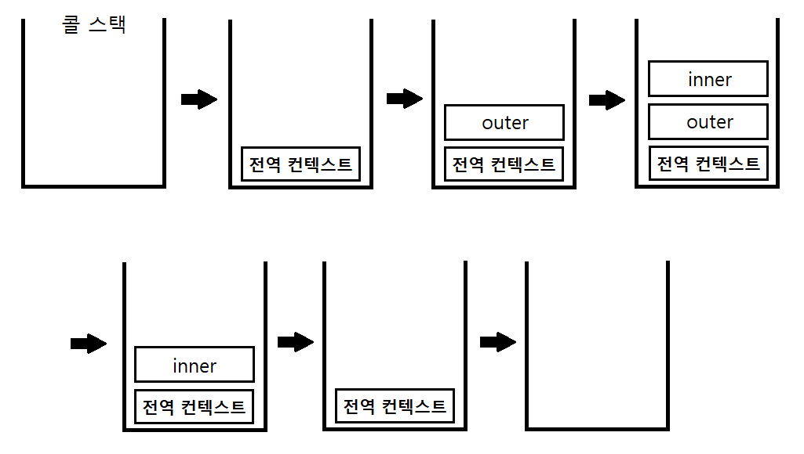
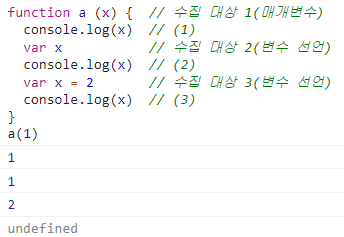
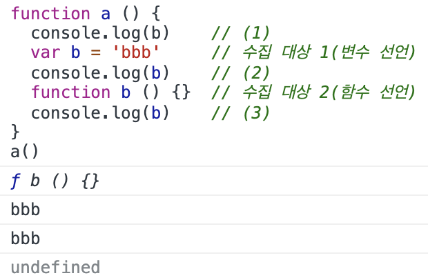

실행 컨텍스트(execution context)는 **실행할 코드에 제공할 환경 정보들을 모아놓은 객체**로, 자바스크립트의 **동적 언어**로서의 성격을 가장 잘 파악할 수 있는 개념이다.  
자바스크립트는 어떤 실행 컨텍스트가 활성화되는 시점에 선언된 변수를 위로 끌어올리고(호이스팅), 외부 환경 정보를 구성하고, this 값을 설정하는 등의 동작을 수행하는데, 이로 인해 다른 언어에서는 발견할 수 없는 특이한 현상들이 발생한다.

## 실행 컨텍스트란?

**동일한 환경**에 있는 코드들을 실행할 때 필요한 환경 정보들을 모아 컨텍스트를 구성하고, 이를 콜 스택(call stack)에 쌓아올렸다가, 가장 위에 쌓여있는 컨텍스트와 관련 있는 코드들을 실행하는 식으로 전체 코드의 환경과 순서를 보장한다. 여기서 '동일한 환경', 즉 하나의 실행 컨텍스트를 구성할 수 있는 방법으로 전역 공간, eval 함수, 함수 등이 있다. 자동으로 생성되는 전역공간과 eval을 제외하면 우리가 흔히 실행 컨텍스트를 구성하는 방법은 **함수를 실행**하는 것뿐이다(ES6에서는 블록({ })에 의해서도 새로운 실행 컨텍스트가 생성된다).

- 실행 컨텍스트와 콜 스택

```js
// -------------------- (1)
var a = 1
function outer() {
  function inner() {
    console.log(a) // undefined
    var a = 3
  }
  inner() // --------- (2)
  console.log(a) // 1
}
outer() // ----------- (3)
console.log(a) // 1
```

- 실행 컨텍스트와 콜 스택

  

처음 자바스크립트 코드를 실행하는 순간(1) **전역 컨텍스트**가 콜 스택에 담긴다.  
전역 컨텍스트라는 개념은 일반적인 실행 컨텍스트와 크게 다를 것이 없다(굳이 차이점을 찾자면 전역 컨텍스트가 관여하는 대상은 함수가 아닌 전역 공간이기 때문에 arguments가 없다. 전역 공간을 둘러싼 외부 스코프란 존재할 수 없기 때문에 스코프 체인 상에는 전역 스코프 하나만 존재한다).  
**최상단의 공간은 코드 내부에서 별도의 실행 명령이 없어도 브라우저에서 자동으로 실행**하므로 **자바스크립트 파일이 열리는 순간 전역 컨텍스트가 활성화** 된다고 이해하면 된다.

콜 스택에는 전역 컨텍스트 외에 다른 덩어리가 없으므로 전역 컨텍스트와 관련된 코드들을 순차로 진행하다가 (3)에서 outer 함수를 호출하면 자바스크립트 엔진은 outer 에 대한 환경 정보를 수집해서 outer 실행 컨텍스트를 생성한 후 콜 스택에 담는다.  
콜 스택 맨 위에 outer 실행 컨텍스트가 놓인 상태가 됐으므로 전역 컨텍스트와 관련된 코드의 실행을 일시중단하고 outer 실행 컨텍스트와 관련된 코드, 즉 outer 함수 내부의 코드들을 순차적으로 실행한다.

다시 (2)에서 inner 함수의 실행 컨텍스트가 콜 스택의 가장 위에 담기면 outer 컨텍스트와 관련된 코드의 실행을 중단하고 inner 함수 내부의 코드를 순서대로 진행한다.  
inner 함수 내부에서 a 변수에 값 3을 할당하고 나면, inner 함수의 실행이 종료되면서 inner 실행 컨텍스트가 콜 스택에서 제거된다. 그러면 아래에 있던 outer 컨텍스트가 콜 스택의 맨 위에 존재하게 되므로 중단했던 (2)의 다음 줄부터 이어서 실행한다.

a 변수의 값을 출력하고 나면 outer 함수의 실행이 종료되어 outer 실행 컨텍스트가 콜 스택에서 제거되고, 콜 스택에는 전역 컨텍스트만 남아 있게 된다. 그런 다음, 실행을 중단했던 (3)의 다음 줄부터 이어서 실행한다. a 변수의 값을 출력하고 나면 전역 공간에 더는 실행할 코드가 남아 있지 않아 전역 컨텍스트도 제거되고, 콜 스택에는 아무것도 남지 않은 상태로 종료된다.

스택 구조를 잘 생각해보면 한 **실행 컨텍스트가 콜 스택의 맨 위에 쌓이는 순간이 곧 현재 실행할 코드에 관여하게 되는 시점**임을 알 수 있다. 기존의 컨텍스트는 새로 쌓인 컨텍스트보다 아래에 위치할 수 밖에 없기 때문이다.

이렇게 어떤 실행 컨텍스트가 활성화될 때 자바스크립트 엔진은 해당 컨텍스트에 관련된 코드들을 실행하는 데 필요한 환경 정보들을 수집해서 실행 컨텍스트 객체에 저장한다. 이 객체는 자바스크립트 엔진이 활용할 목적으로 생성할 뿐 개발자가 코드를 통해 확인할 수는 없다.

- 활성화된 실행 컨텍스트의 수집 정보
  - VariableEnvironment
    현재 컨텍스트 내의 식별자들에 대한 정보 + 외부 환경 정보  
    (**선언 시점의 LexicalEnvironment의 스냅샷**으로 변경 사항은 반영되지 않음)
  - LexicalEnvironment: 처음에는 VariableEnvironment와 같지만 변경 사항이 실시간으로 반영됨
  - ThisBinding: this 식별자가 바라봐야 할 대상 객체

---

### VariableEnvironment

VariableEnvironment에 담기는 내용은 LexicalEnvironmene와 같지만 최초 실행시의 스냅샷을 유지한다는 점이 다르다. **실행 컨텍스트를 생성할 때 VariableEnvironment에 정보를 먼저 담은 다음, 이를 그대로 복사해서 LexicalEnvironment를 만들고, 이후에는 LexicalEnvironment를 주로 활용**하게 된다.

VariableEnvironment와 LexicalEnvironment의 내부는 environmentRecord와 outerEnvironmentReference로 구성돼 있다. 초기화 과정 중에는 사실상 완전히 동일하고 이후 코드 진행에 따라 서로 달라지게 된다.

### LexicalEnvironment

lexical environment에 대한 한국어 번역은 문서마다 제각각 다른데 '어휘적 환경', '정적 환경'이라는 단어가 가장 많이 등장한다.  
'어휘적'은 lexical을 영어사전에 대입해서 치환한 것으로 의미가 와 닿지 않고, '정적'이라는 말은 수시로 변하는 환경 정보를 의미하는 lexical environment에 대한 적절한 번역이라고 볼 수 없다.

이보다는 '사전적인'이 더 어울리는 표현이라고 생각한다. 즉 "현재 컨텍스트의 내부에는 a, b, c와 같은 식별자들이 있고 그 외부 정보는 D를 참조하도록 구성돼있다"라는, 컨텍스트를 구성하는 환경 정보들을 사전에서 접하는 느낌으로 모아놓은 것이다.

### environmentRecord와 호이스팅

environment에는 **현재 컨텍스트와 관련된 코드의 식별자** 정보들이 저장된다. 컨텍스트를 구성하는 함수에 지정된 **매개변수 식별자**, **선언한 함수**가 있을 경우 그 함수 자체, **var로 선언된 변수**의 식별자 등이 식별자에 해당한다. 컨텍스트 내부 전체를 처음부터 끝까지 쭉 훑어나가며 **순서대로** 수집한다.

#### 📝 전역 실행 컨텍스트

전역 실행 컨텍스트는 변수 객체를 생성하는 대신 **자바스크립트 구동 환경이 별도로 재공**하는 객체, 즉 **전역 객체(global object)를 활용**한다.  
전역 객체에는 브라우저의 window, Node.js의 global 객체 등이 있다. 이들은 자바스크립트의 내장 객체(native object)가 아닌 호스트 객체(host object)로 분류된다.

변수 정보를 수집하는 과정을 모두 마쳤더라도 아직 실행 컨텍스트가 관여할 코드들은 실행되기 전의 상태다. 코드가 실행 전임에도 불구하고 자바스크립트 엔진은 이미 해당 환경에 속한 코드의 변수명을 모두 알고 있게 되는 셈이다. 그렇다면 엔진의 실제 동작 방식 대신에 **"자바스크립트 엔진은 식별자들을 최상단으로 끌어올려놓은 다음 실제 코드를 실행한다"**라고 생각하더라도 코드를 해석하는 데는 문제될 것이 전혀 없을 것이다.

여기서 **호이스팅(hoisting)**이라는 개념이 등장한다. 호이스팅이란 '끌어올리다'라는 의미의 hoist에 ing를 붙여 만든 동명사로, **변수 정보를 수집하는 과정을 더욱 이해하기 쉬운 방법으로 대체한 가상의 개념**이다. 자바스크립트 엔진이 실제로 끌어올리지는 않지만 편의상 끌어올린 것으로 간주하자는 것이다.

---

- 호이스팅 규칙 - 매개변수와 변수에 대한 호이스팅(1) - 원본 코드

```js
function a(x) {
  // 수집 대상 1(매개변수)
  console.log(x) // (1)
  var x // 수집 대상 2(변수 선언)
  console.log(x) // (2)
  var x = 2 // 수집 대상 3(변수 선언)
  console.log(x) // (3)
}
a(1)
```

인자들과 함께 함수를 호출한 경우의 동작을 살펴보면, arguments에 전달된 인자를 담는 것을 제외하면 (매개변수 사용이)코드 내부에서 변수를 선언한 것과 다른 점이 없다. 특히 LexicalEnvironment의 입장에서는 완전히 같다. 인자를 함수 내부의 다른 코드보다 먼저 선언 및 할당이 이뤄진 것으로 간주할 수 있다.

#### 📝 arguments

실행 컨텍스트 생성 시점에 함께 만드는 정보 중 하나로서, **지정한 매개변수의 개수와 무관하게 호출 시 전달한 인자**가 모두 arguments 정보에 담긴다.  
배열이 아닌 유사 배열 객체라서 배열처럼 활용하기 위해서는 별도의 처리가 필요하다. 또한 함수 내부에서 매개변수의 값을 바꾸면 arguments의 값도 함께 바뀌는데, 이는 '전달된 인자를 모두 저장한 데이터'라는 본래의 개념과 상이하다. 이러한 문제 인식하에 ES6에서는 새롭게 나머지 파라미터(rest parameter)가 새롭게 등장했고 이는 arguments를 온전히 대체할 수 있다.

- 호이스팅 규칙 - 매개변수와 변수에 대한 호이스팅(2) - 매개변수를 변수 선언/할당과 같다고 간주해서 변환한 상태

```js
function a() {
  var x = 1 // 수집 대상 1(매개변수 선언)
  console.log(x) // (1)
  var x // 수집 대상 2(변수 선언)
  console.log(x) // (2)
  var x = 2 // 수집 대상 3(변수 선언)
  console.log(x) // (3)
}
a()
```

위 상태에서 변수 정보를 수집하는 과정(호이스팅)을 처리해보면, **environmentRecord는 현재 실행될 컨텍스트의 대상 코드 내에 어떤 식별자들이 있는지에만 관심**이 있고, 각 식별자에 어떤 값이 할당될 것인지는 관심이 없다. 따라서 **변수를 호이스팅할 때 변수명만 끌어올리고** 할당 과정은 원래 자리에 그대로 남겨둔다. 매개변수의 경우도 마찬가지다. environmentRecord의 관심사에 맞춰 수집 대상 1, 2, 3을 순서대로 끌어올리고 나면 다음과 같은 형태로 바뀐다.

- 호이스팅 규칙 - 매개변수와 변수에 대한 호이스팅(3) - 호이스팅을 마친 상태

```js
function () {
  var x           // 수집 대상 1의 변수 선언 부분
  var x           // 수집 대상 2의 변수 선언 부분
  var x           // 수집 대상 3의 변수 선언 부분

  x = 1           // 수집 대상 1의 할당 부분
  console.log(x)  // (1)
  console.log(x)  // (2)
  x = 2           // 수집 대상 3의 할당 부분
  console.log(x)  // (3)
}
a(1)
```

- 2번째 줄: 변수 x를 선언한다. 이때 메모리에서는 저장할 공간을 미리 확보하고, 확보한 공간의 주솟값을 변수 x에 연결해둔다.
- 3, 4번째 줄: 다시 변수 x를 선언한다. 이미 선언한 변수 x가 있으므로 무시한다.
- 6번째 줄: x에 1을 할당하라고 한다. 우선 숫자 1을 별도의 메모리에 담고, x와 연결된 메모리 공간에 숫자 1을 가리키는 주솟값을 입력한다.
- 7, 8번째 줄: 각 x를 출력하라고 한다. (1), (2) 모두 1이 출력된다.
- 9번째 줄: x에 2를 할당하라고 한다. 숫자 2를 별도의 메모리에 담고, 그 주솟값을 든 채로 x와 연결된 메모리 공간으로 간다.  
  여기에는 숫자 1을 가리키는 주솟값이 들어있었는데, 이걸 2의 주솟값으로 대치한다. 이제 변수 x는 숫자 2를 가리키게 된다.
- 10번째 줄: x 값으로 (3)에서는 2가 출력된다. 이제 함수 내부의 모든 코드가 실행됐으므로 실행 컨텍스트가 콜 스택에서 제거된다.

**실제 코드 실행 결과**



---

- 호이스팅 규칙 - 함수 선언의 호이스팅(1) - 원본 코드

```js
function a() {
  console.log(b) // (1)
  var b = "bbb" // 수집 대상 1(변수 선언)
  console.log(b) // (2)
  function b() {} // 수집 대상 2(함수 선언)
  console.log(b) // (3)
}
a()
```

a 함수를 실행하는 순간 a 함수의 실행 컨텍스트가 생성된다. 이 때 변수명과 함수선언의 정보를 위로 끌어올린다(수집한다).  
변수는 선언부와 할당부를 나누어 선언부만 끌어올리는 반면 **함수 선언은 전체를 끌어올린다**.

- 호이스팅 규칙 - 함수 선언의 호이스팅(2) - 호이스팅을 마친 상태

```js
function a() {
  var b // 수집 대상 1. 변수는 선언부만 끌어올린다.
  function b() {} // 수집 대상 2. 함수 선언은 전체를 끌어올린다.

  console.log(b) // (1)
  b = "bbb" // 변수의 할당부는 원래 자리에 남겨둔다.
  console.log(b) // (2)
  console.log(b) // (3)
}
a()
```

호이스팅이 끝난 상태에서의 함수 선언문은 함수명으로 선언한 변수에 함수를 할당한 것처럼 여길 수 있다.

- 호이스팅 규칙 - 함수 선언의 호이스팅(3) - 함수 선언문을 함수 표현식으로 바꾼 코드

```js
function a() {
  var b
  var b = function b() {}

  console.log(b) // (1)
  b = "bbb"
  console.log(b) // (2)
  console.log(b) // (3)
}
a()
```

- 2번째 줄: 변수 b를 선언한다. 이때 메모리에서는 저장할 공간을 미리 확보하고, 확보한 공간의 주솟값을 변수 b에 연결해둔다.
- 3번째 줄: 다시 변수 b를 선언하고 함수 b를 선언된 변수 b에 할당한다. 이미 선언된 변수 b가 있으므로 선언 과정은 무시한다.
  함수는 별도의 메모리에 담기고, 그 함수가 저장된 주솟값을 b와 연결된 공간에 저장한다. 이제 변수 b는 함수를 가리키게 된다.
- 5번째 줄: (1) 변수 b에 할당된 함수 b를 출력한다.
- 6번째 줄: 변수 b에 'bbb'를 할당한다. b와 연결된 메모리 공간에는 함수가 저장된 주솟값이 담겨있었는데
  이를 문자열 'bbb'가 담긴 주솟값으로 덮어쓴다. 이제 변수 b는 문자열 'bbb'를 가리키게 된다.
- 7, 8번째 줄: (2), (3) 모두 'bbb'가 출력된다. 이제 함수 내부의 모든 코드가 실행되어 실행 컨텍스트가 콜 스택에서 제거된다.

**실제 코드 실행 결과**



---

<출처>

- 정재남, 코어 자바스크립트, 위키북스(2019)
