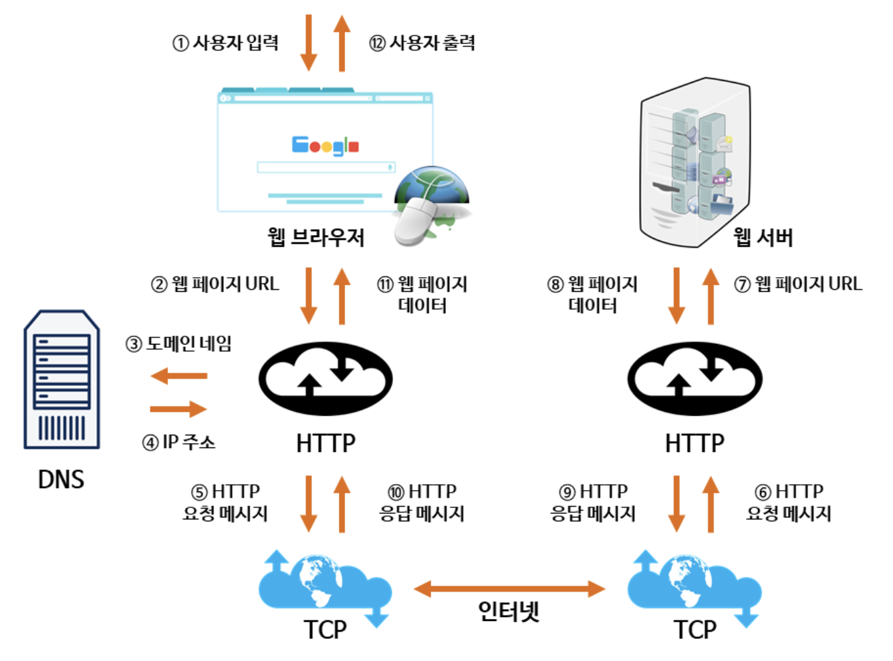

## 웹(web)의 개념과 구성

웹은 `인터넷`에 연결된 사용자들이 서로의 정보를 공유할 수 있는 **공간**이다.

- 📝 인터넷(internet)  
  전 세계 컴퓨터(**클라이언트와 서버**로 구성)를 하나로 연결하는 거대한 **통신망**이다.  
  여러 통신망을 하나로 연결한다는 의미의 'inter-network'라는 말에서 유래했다.

웹은 인터넷 상에서 텍스트, 멀티 미디어 정보를 `하이퍼텍스트`방식으로 연결하여 제공한다.

- 📝 하이퍼텍스트(hypertext)  
  문서 내부에 또 다른 문서로 연결되는 참조(하이퍼링크; hyperlink)로써 웹 상에 존재하는 여러 문서를 서로 참조할 수 있는 기술이다.

웹에 존재하는 HTML 문서(웹 페이지)에는 **HTTP**(Hypertext Transfer Protocol; 클라이언트-서버 간 통신 규약)를 사용하여 누구나 접근할 수 있다. 웹 페이지 중에서 서로 연관된 내용으로 작성된 페이지의 집합은 웹 사이트(web site)다.

### 클라이언트(client)와 서버(server)

웹의 동작은 인터넷에 연결된 수많은 클라이언트와 서버의 상호 작용으로 이루어진다.  
클라이언트는 서버가 제공하는 자원을 이용하는 사용자 또는 사용자가 사용하는 기기를 의미한다. 웹에서는 여러 웹 사이트를 방문할 때 사용하는 웹 브라우저를 예로 들 수 있다. **웹 브라우저**는 웹 서버에 요청한 자원(웹 페이지 정보)을 제공받아 사용자에게 출력한다.  
서버는 클라이언트가 요청하는 자원을 제공하는 컴퓨터다. 웹에서는 웹 사이트의 정보를 담고 있는 프로그램이나 컴퓨터를 웹 서버라 한다. **웹 서버**는 웹 브라우저의 요청에 응답하고 필요한 자원을 제공한다.

## 웹의 동작 과정

웹 브라우저가 서버에 요청한 **웹 페이지가 출력되는 과정**을 도식화하면 아래와 같다.

<h6 align=center >사진 출처: https://tcpschool.com/webbasic/works</h6>

1. 사용자가 웹 브라우저에서 찾고 싶은 웹 페이지의 **URL**을 입력한다.
2. 입력된 URL에서 **도메인 네임(domain name)** 부분은 DNS 서버에서 검색된다.
3. DNS 서버에서 검색된 도메인 네임에 해당하는 **IP 주소**를 찾아 사용자가 입력한 URL 정보와 함께 전달된다.
4. URL 정보와 IP 주소는 **HTTP 요청** 메시지로 생성되고, 이 메시지는 **TCP**를 사용하여 인터넷을 거쳐 해당 IP 주소의 컴퓨터로 전송된다.
5. 웹 서버는 전송된 HTTP 요청 메시지에서 변환된 웹 페이지 URL 정보에 해당하는 데이터를 검색한다.
6. 검색된 웹 페이지 데이터는 다시 **HTTP 응답** 메시지로 생성되고, 이 메시지는 TCP를 사용하여 인터넷을 거쳐 정보를 요청한 컴퓨터로 전송된다.
7. 웹 브라우저는 전송된 HTTP 응답 메시지에서 변환된 웹 페이지 데이터를 사용자에게 출력한다.

📝 패킷(packet)  
웹 서버에서 클라이언트로 전송되는 데이터의 형식이다. 수천 개의 작은 덩어리로 구성되어 있어서 다양한 사용자가 동시에 같은 웹 페이지 데이터를 다운로드 할 수 있다.

<출처>

- [MDN: 웹의 동작 방식](https://developer.mozilla.org/ko/docs/Learn/Getting_started_with_the_web/How_the_Web_works)
- [TCP School: 인터넷이란?](https://tcpschool.com/webbasic/intro)
- [TCP School: 웹이란?](https://tcpschool.com/webbasic/www)
- [TCP School: 인터넷 구성 요소](https://tcpschool.com/webbasic/component)
- [TCP School: 인터넷 주소 체계](https://tcpschool.com/webbasic/address)
- [TCP School: 웹의 동작 원리](https://tcpschool.com/webbasic/works)
